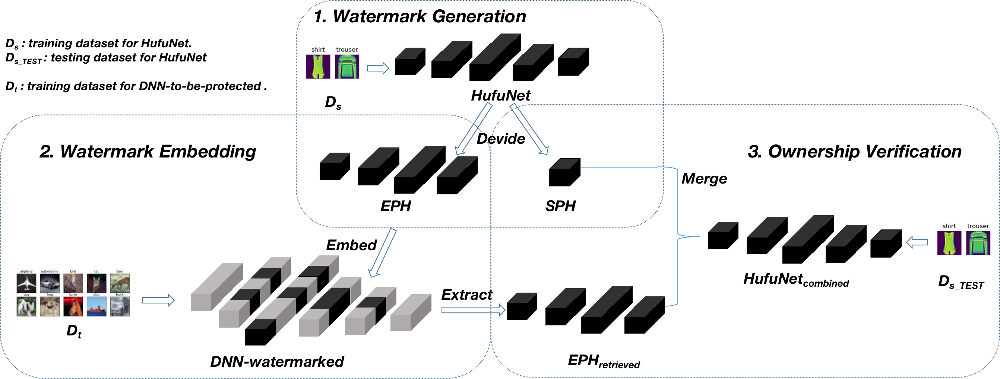

# [HufuNet: Embedding The Left Piece as Watermark and Keeping The Right Piece for Ownership Verification in Deep Neural Networks]

A PyTorch introduction of HufuNet.


## Introduction
This code includes experiments for paper "HufuNet: Embedding the Left Piece as Watermark and Keeping the Right Piece for Ownership Verification in Deep Neural Networks" (https://arxiv.org/abs/2103.13628)

the following is the workflow of HufuNet:



## Usage

Generate HufuNet:
```bash
python train.py --model==FLenet --checkpoint==FLenet --epochs=100  ==>  FLenet.t7 (92.60%)
```
Embedded HufuNet into VGG:
```bash
python train.py --model=VGG --checkpoint=VGG_init --epochs=1  ==>  VGG_init.t7 (39.59%)
python vgg_grad_false.py  ==>  VGG_done_3*3.t7(Final Poisoned Model 77.57%) 
```
Simulate Attacking Watermarked-VGG Model:
```bash
python vgg_grad_true.py  ==>  VGG_done_finetune100.t7 (Finetune 75.15%)
python prune.py --prune_rate=60  ==>  VGG_done_3*3_prune60.t7 (Prune 71.65%)
python simulate_reorder_attack.py  ==>  VGG_ReOrder.t7 (Reorder 71.65%)
python simulate_EnlargeC_attack.py  ==>  VGG_EnlargeC.t7 (Final Victim Model 71.65%)
```
Restore VGG to Origin:
```bash
python simulate_restore_scale.py  ==>  VGG_RestoreCoff.t7 (Restore Number Scale)
python simulate_restore_order.py  ==>  VGG_RestoreOrder.t7 (Restore Filters Position)
```
Extract HufuNet from VGG and verify it on FASHION-MNIST:
```bash
python structureDiff_and_convertEmbed.py --model1=FLenet --model2=VGG_RestoreOrder
```
Draw Cos-Similarity Distribution of VGG:
```bash
python draw_parameters_distribution.py
```
