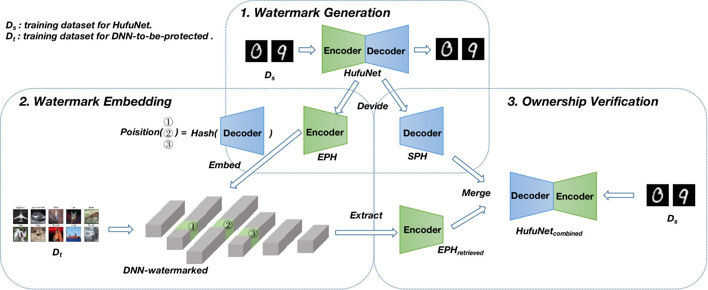

# [A Robustness-Assured White-Box Watermark in Neural Networks]

A PyTorch introduction of updated HufuNet. The original version of Hufunet is placed in "./Hufu_Old"


## Introduction
This code includes experiments for paper "HufuNet: Embedding Encoder as Watermark and Keeping Decoder for Ownership Verification in Deep Neural Networks"

the following is the workflow of HufuNet:



## Usage

Generate HufuNet:
```bash
python train_autoencoder.py --epochs=100  ==>  model_decoder_param.t7 / model_encoder_param.t7
```
Embed HufuNet into VGG and start training:
```bash
python train.py --model=VGG --checkpoint=VGG_init --epochs=1 ==> VGG_init.t7
python Union_type.py --model=VGG --checkpoint=VGG_done --prepared_model ./checkpoints/VGG_init.t7 --epoch=50 ==> VGG_embeded.t7 / VGG_done.t7
```

Simulate Attacking Watermarked-VGG Model:
```bash
python train.py --model=VGG --checkpoint=VGG_finetuned --epochs=50 --finetune=1 --load_from=VGG_done ==> VGG_finetuned.t7
python prune.py --prune_rate=60  ==>  VGG_prune60.t7 
python simulate_reorder_attack.py  ==>  VGG_ReOrder.t7 
python simulate_EnlargeC_attack.py  ==>  VGG_EnlargeC.t7
```

Restore VGG to Origin:
```bash
python simulate_restore_scale.py  ==>  VGG_RestoreCoff.t7 
python simulate_restore_order.py  ==>  VGG_RestoreOrder.t7
```
Extract HufuNet from VGG, verify it on FASHION-MNIST and verify final VGG on CIFAR-10:
```bash
python Eval.py --load_from=VGG_RestoreOrder
```

Draw Cos-Similarity Distribution of VGG:
```bash
python draw_parameters_distribution.py
```

## Citation
If it helps you, you can cite our paper as below:
```bash
@ARTICLE{10038500,
  author={Lv, Peizhuo and Li, Pan and Zhang, Shengzhi and Chen, Kai and Liang, Ruigang and Ma, Hualong and Zhao, Yue and Li, Yingjiu},
  journal={IEEE Transactions on Dependable and Secure Computing}, 
  title={A Robustness-Assured White-Box Watermark in Neural Networks}, 
  year={2023},
  volume={},
  number={},
  pages={1-14},
  doi={10.1109/TDSC.2023.3242737}}
```
