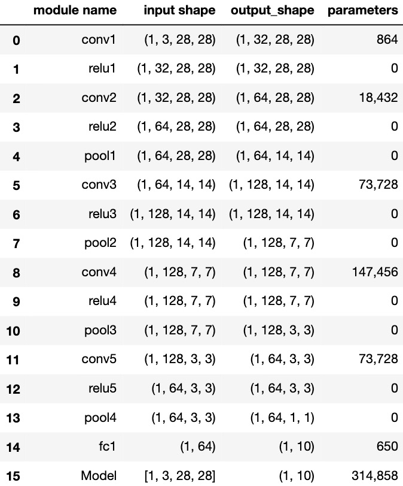

# [HufuNet: Embedding The Left Piece as Watermark and Keeping The Right Piece for Ownership Verification in Deep Neural Networks]

A PyTorch introduction of HufuNet.


Since our paper has not been published yet, we first give part of the verification code. Model training and HufuNet embedded code are then open source after our paper is accepted. I'm currently in the process of updating this to work with PyTorch! Currently the only network type that works is Resnet18 as DNN-watermarked, other networks coming soon. 


## Introduction

Given a watermark as HufuNet, the following is the workflow of HufuNet:


The following is the network structure parameters of HufuNet:



## Usage

Generate HufuNet:
```bash
python train.py --model=HufuNet --checkpoint=HufuNet
```
Verify the performance of Resnet18 embedded with EPH on CIFAR-10:
```bash
python verify.py --model=resnet18 --checkpoint=resnet18_done
```
Extract HufuNet from Resnet18 and verify it on FASHION-MNIST:
```bash
python convertEmbed.py --model1=HufuNet --model2=resnet18_done
```
